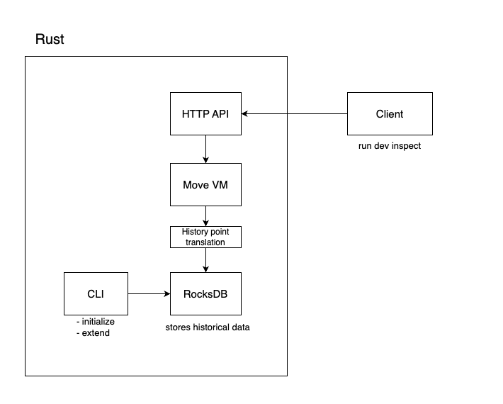

# Historical Dev Inspect

Historical Dev Inspect is a developer tool that extends the Sui devInspectTransactionBlock functionality to support historical chain state. It allows you to simulate transactions as if they were executed at any past checkpoint, enabling powerful use cases like on-chain forensics, debugging, and data backfilling. Once the database is initialized, you can run queries **for any checkpoint within the range**.

## Overview

Key Features

- ⚙️ Rust-based core for performance and reliability
- 🧠 RocksDB-backed storage for historical chain data
- 🛠️ CLI tools for flexible, selective data initialization (by epoch, day, or checkpoint)
- 🌐 HTTP API compatible with existing devInspect workflows and tooling
- ⏪ Historical simulation without needing full chain history (sparse historical data supported)

This tool is ideal for developers building explorers, performing forensics, backfilling data, or running historical analyses on-chain.

## Getting Started

### Prerequisites

- Rust toolchain (latest stable version recommended)
- Sufficient disk space for storing historical data
- Network connection to access Sui checkpoints

### Installation

```bash
cargo install --path crates/historical-dev-inspect
```

### Usage

The tool provides three main commands:

#### 1. Initialize Database

Initialize a new database with historical data from a specific epoch:

```bash
historical-dev-inspect initialize-db \
    --db-path /path/to/database \
    --start-epoch <epoch_number> \
    --end-checkpoint <checkpoint_number> \
    --snapshot-dir /path/to/snapshot/directory \
    --concurrency 50
```

You can later run queries for any checkpoint within this range.

#### 2. Extend Database

Add more checkpoints to an existing database:

```bash
historical-dev-inspect extend-db \
    --db-path /path/to/database \
    --end-checkpoint <checkpoint_number> \
    --concurrency 50
```

This increases the range of historical data available for querying.

#### 3. Start RPC Server

Start an RPC server to query the historical data:

```bash
historical-dev-inspect start-rpc \
    --db-path /path/to/database \
    --port 8000
```

You can send requests to simulate transactions at any checkpoint the database contains.

### Example Workflow

1. Initialize a new database starting from epoch 1:

```bash
historical-dev-inspect initialize-db \
    --db-path ./sui-history \
    --start-epoch 1 \
    --end-checkpoint 1000 \
    --snapshot-dir ./snapshots
```

2. Start the RPC server to query the data:

```bash
historical-dev-inspect start-rpc \
    --db-path ./sui-history \
    --port 8000
```

The server will be available at `http://localhost:8000`.

## Client Usage

The TypeScript client provides a convenient way to interact with the historical dev inspect server:

```typescript
import { HistoricalDevInspectClient } from "./client";
import { SuiClient } from "@mysten/sui/client";
import { Transaction } from "@mysten/sui/transactions";

// Initialize clients
const suiClient = new SuiClient({ url: "https://fullnode.mainnet.sui.io" });
const histClient = new HistoricalDevInspectClient(
  "http://localhost:8000",
  suiClient
);

// Example: Get timestamp at checkpoint
async function getTimestampAtCheckpoint(checkpointNumber: number) {
  const tx = new Transaction();
  tx.moveCall({
    target: "0x2::clock::timestamp_ms",
    arguments: [tx.object.clock()],
  });

  const result = await histClient.devInspectTransactionBlock({
    sender: normalizeSuiAddress("0x0"),
    transactionBlock: tx,
    executionPoint: {
      checkpointSequenceNumber: checkpointNumber,
      position: "after",
    },
  });

  return new Date(
    Number(
      bcs
        .u64()
        .parse(
          Uint8Array.from(result.results?.[0].returnValues?.[0][0] as number[])
        )
    )
  );
}
```

The client supports both checkpoint-based and transaction-based execution points. See the source code for more complex examples.

## Architecture Diagram



## System Components

### Data Layer

- **CLI Tool**: Initializes and extends the historical database by fetching chain data (checkpoints, objects, transactions, and metadata) from Sui fullnodes
- **RocksDB Storage**: Stores historical object versions and transaction metadata in a compact, indexed format optimized for point-in-time queries.

### Execution Layer

- **Translation Layer**: Reconstructs complete historical chain state at any specified checkpoint by aggregating indexed data and exposing it through a `HistoricalView` interface compatible with the Move VM
- **Move VM Executor**: Executes simulated transactions against the reconstructed historical state, providing identical behavior to what would have occurred at that point in time

### Interface Layer

- **HTTP API Server**: Accepts `devInspect`-compatible requests with historical execution points (checkpoint + position) and returns standard Sui simulation output
- **TypeScript Client**: Drop-in replacement for standard `devInspectTransactionBlock` calls, compatible with existing Sui tooling and SDKs

## Use-cases

- **On-chain Research**: Analyze DeFi protocols, NFT marketplaces, and other systems at specific historical points.

- **Forensic Analysis**: Reconstruct past incidents, exploits, or unusual market events by simulating transactions and inspecting chain state at key moments.

- **Application Debugging**: Test and debug applications against historical chain states to reproduce and fix issues. Validate that your application would have behaved correctly during past network conditions or specific transaction scenarios.

- **Historical Data Indexing**: Power dashboards, visualizations, and analytics platforms with accurate historical on-chain data. Build comprehensive datasets that capture the full context of past transactions and state changes.

- **Data Recovery & Backfilling**: Recover missing data for indexers, APIs, or services that experienced downtime or interruptions. Fill gaps in your historical datasets with precise, verifiable on-chain information.

- **Enhanced Blockchain Exploration**: Build advanced blockchain explorers that display rich transaction details by surfacing actual return values from Move function calls, internal state changes, and computed results that aren't normally visible.
